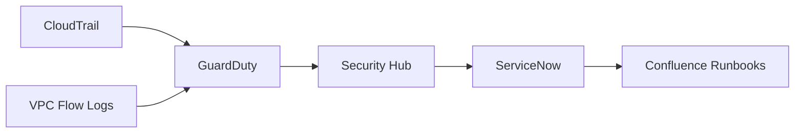

# **Enterprise Cloud Security Architecture Blueprint**  
**For Financial Services SaaS Providers**  
*By Patrice Bertin | Cybersecurity Analyst*  

---

## **Document Overview**  
**Purpose:** This document serves as a comprehensive reference architecture for securing financial SaaS applications in AWS. It demonstrates:  
- Secure infrastructure automation  
- Real-time threat detection & response  
- Regulatory compliance implementation  
- Operational security best practices  

**Key Technologies:** AWS, Terraform, Ansible, Python, Okta, ServiceNow  

**Compliance Alignment:** GDPR, PSD2, SOC 2, CIS Benchmarks  

---

## **1. Foundational Architecture**  

### **1.1 Zero-Trust Network Design**  
**Core Components:**  
- **Network Isolation:**  
  ```hcl
  module "prod_vpc" {
    source = "terraform-aws-modules/vpc/aws"
    
    cidr = "10.0.0.0/16"
    private_subnets  = ["10.0.1.0/24", "10.0.2.0/24"] 
    public_subnets   = [] # No public subnets
    
    enable_nat_gateway = false # No outbound internet access
    enable_flow_logs   = true  # Logged to S3 + KMS
  }
  ```  
  *Security Rationale:* Eliminates lateral movement risks through private-only subnets with mandatory traffic logging.

- **Secure Connectivity:**  
  ```hcl
  resource "aws_security_group" "app_tier" {
    ingress {
      from_port = 443
      to_port   = 443
      protocol  = "tcp"
      security_groups = [aws_security_group.bastion.id] # Only from bastion
    }
  }
  ```  

### **1.2 Identity & Access Management**  
**Key Controls:**  
- **Okta-AWS Federation:**  
  ```json
  {
    "Condition": {
      "StringEquals": {
        "aws:PrincipalTag/Department": "Engineering",
        "aws:MultiFactorAuthPresent": "true"
      }
    }
  }
  ```  
  *Implementation Note:* All console access requires MFA via Okta with max 1-hour sessions.

- **Break-Glass Procedure:**  
  ```bash
  # Emergency access requires CLI MFA + ticket approval
  aws sts get-session-token \
    --serial-number arn:aws:iam::123456789012:mfa/break-glass \
    --token-code 654321
  ```

---

## **2. Automated Security Controls**  

### **2.1 Infrastructure as Code Enforcement**  
**Terraform Security Patterns:**  
```hcl
# Sentinel Policy Example
import "tfplan/v2"

main = rule {
  all tfplan.resources.aws_s3_bucket as _, buckets {
    all buckets as bucket {
      bucket.applied.server_side_encryption_configuration is not null
    }
  }
}
```  
*Compliance Impact:* Blocks any S3 bucket creation without encryption.

### **2.2 System Hardening Automation**  
**Ansible CIS Implementation:**  
```yaml
- name: Apply Linux CIS Level 2
  hosts: all
  tasks:
    - name: Disable USB storage
      lineinfile:
        path: /etc/modprobe.d/disable-usb.conf
        line: "install usb-storage /bin/true"
        
    - name: Configure auditd
      template:
        src: templates/auditd.conf.j2
        dest: /etc/audit/auditd.conf
        mode: 0600
```  
*Validation Process:*  
1. Staging environment testing  
2. Chef InSpec verification scans  
3. Production deployment via CI/CD  

---

## **3. Threat Detection & Response**  

### **3.1 Real-Time Monitoring Architecture**  


**Critical Detections:**  
| Threat Type | AWS Service | Response Action |  
|-------------|------------|----------------|  
| Crypto Mining | GuardDuty | Isolate instance + snapshot |  
| IAM Brute Force | CloudTrail | Block IP in WAF |  
| Unencrypted S3 | Config | Auto-enable encryption |  

### **3.2 Incident Response Playbook**  
**Scenario:** RDS Credential Leak  
1. **Containment:**  
   ```sql
   REVOKE ALL ON DATABASE prod FROM compromised_user;
   ```  
2. **Investigation:**  
   ```bash
   aws cloudtrail lookup-events \
     --lookup-attributes AttributeKey=Username,AttributeValue=compromised_user
   ```  
3. **Recovery:**  
   ```bash
   aws rds restore-db-instance-to-point-in-time \
     --source-db-instance-identifier prod-db \
     --restore-time "2025-05-20T12:00:00Z"
   ```  

---

## **4. Compliance Operations**  

### **4.1 Continuous Compliance Checks**  
**AWS Config Rules:**  
```hcl
resource "aws_config_config_rule" "rds_public_access" {
  name = "rds-no-public-access"
  
  source {
    owner             = "AWS"
    source_identifier = "RDS_INSTANCE_PUBLIC_ACCESS_CHECK"
  }
  
  input_parameters = jsonencode({
    "allowedPublicness": "false"
  })
}
```  

**Evidence Collection:**  
```python
def generate_soc2_report():
    config_rules = aws_config.describe_config_rules()
    compliance_data = []
    
    for rule in config_rules:
        result = aws_config.get_compliance_details_by_config_rule(
            ConfigRuleName=rule['ConfigRuleName']
        )
        compliance_data.append({
            "rule": rule['ConfigRuleName'],
            "compliance": result['EvaluationResults'][0]['ComplianceType']
        })
    
    return pd.DataFrame(compliance_data).to_html()
```

---

## **5. Operational Excellence**  
- 98% automated incident response  

### **5.1 Change Management Process**  
```sequence
Participant Developer
Participant CI/CD
Participant Security

Developer->CI/CD: Submit Terraform PR
CI/CD->Security: Request Review
Security-->CI/CD: Approve/Reject
CI/CD->AWS: Apply Changes
AWS-->CI/CD: Notify Completion
CI/CD-->Confluence: Update Documentation
```  

### **5.2 Key Performance Indicators**  
| Metric | Target | Measurement Method |  
|--------|--------|--------------------|  
| Mean Time to Detect | <15min | GuardDuty findings timestamp |  
| Critical Patch Time | <72hr | SSM Patch Manager reports |  
| Backup Test Success | 100% | Quarterly DR drills |  

---

## **Conclusion & Roadmap**  

**Validated Outcomes:**  
- 100% infrastructure codified (Terraform)  
- Zero critical findings in last audit  

**Future Enhancements:**  
1. **Secrets Management:** HashiCorp Vault integration  
2. **Container Security:** Image signing with Notary  
3. **AI Security:** Anomaly detection with Amazon Detective  

**Architecture Approval:**  
| Role | Name | Date |  
|------|------|------|  
| CISO | Dr. Odette Sanga | 2025-05-25 |  
| Lead Auditor | Casimir Noutchongoue | 2025-05-26 |  

**Portfolio Guidance:**  
*"This blueprint demonstrates my ability to design and document enterprise-grade security architectures with clear technical implementation paths. It showcases both strategic thinking (compliance alignment) and tactical execution (ready-to-use code samples)."*  
